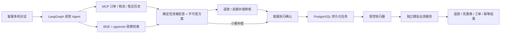

# CommerceFlow Agent v2

可执行、可审核、可恢复的电商售后 Agent。支持多商品订单的商品行质量退款，以及物流延误补偿。

模型通过真实 MCP 查询业务事实、检索中文政策并提交方案。退款必须经过审核员批准；所有退款和补偿必须由客服确认执行。独立模拟业务服务更新退款余额、权益账本和工单，模型没有业务写入权限。

> 本项目使用模拟订单和模拟支付账本，不连接真实支付。v1 的规则评测成绩不是 v2 的大模型成绩。

## 工作流



- **Agent**：Qwen3-8B 非思考模式，真实工具调用；最多 12 次模型调用，无关键词兜底或自动模型切换。
- **业务规则**：退款按问题商品行剩余实付金额计算；质量报告期限为签收后 168 小时；运输中超过 72 小时未移动或实际送达超过承诺时间可补偿。
- **审核绑定**：审批和确认绑定方案内容哈希。修改诉求会使未执行旧方案失效。
- **可靠执行**：确认与任务同事务提交；每案件串行 worker；稳定执行 ID 与业务权益唯一键共同防重。超时先核验原执行结果。
- **权限隔离**：客服/审核员服务端会话；Agent 和 commerce 使用不同数据库账号，不能跨库写入。
- **审计与演示**：可续接 SSE 时间线、政策引用、审核记录、模拟业务凭证。
- **费用**：DeepSeek 显式选用，共享持久化预算；25 元准入上限、30 元任务预算，未知用量保留预留额。

## 运行

需要 Python 3.13、Node.js 22，以及 PostgreSQL 16 + pgvector。完整容器交付使用 Docker Compose。

```bash
python -m venv .venv
# Windows: .venv\Scripts\activate；Linux/macOS: source .venv/bin/activate
pip install torch==2.14.0 --index-url https://download.pytorch.org/whl/cpu
pip install -r services/api/requirements-dev.txt
python deploy/configure.py
python deploy/download_embedding.py
```

编辑自动生成且被 Git 忽略的 `.env.v2`：配置模型地址、模型访问密钥，并在本地读取生成的客服和审核员密码。不要上传此文件。

**完整 Compose**：设置 `CF_CONTAINER_MODEL_URL` 为容器可访问的 Qwen 推理地址，或明确设置 `CF_MODEL_PROVIDER=deepseek` 和 `CF_DEEPSEEK_KEY`。

```bash
docker compose --env-file .env.v2 -f compose.v2.yml up --build -d
```

打开 `http://localhost:3000`。数据库使用独立 `commerceflow-v2` volume，不读取或删除旧版数据。

**原生应用开发**：先启动新数据库，配置 `.env.v2` 中的 `CF_DATABASE_URL` 与 `CF_COMMERCE_DATABASE_URL`。

```bash
docker compose --env-file .env.v2 -f compose.v2.yml up -d postgres
python deploy/local.py exec python -m alembic -c alembic-v2.ini upgrade head
python deploy/local.py exec python -m alembic -c alembic-v2.ini -x database=commerce upgrade head
python deploy/local.py exec python -m commerceflow.bootstrap commerce
python deploy/local.py exec python -m commerceflow.bootstrap agent
cd apps/web
npm ci
cd ../..
python deploy/local.py start
```

原生服务使用 8000/8001/3000 端口，日志及进程记录在 `data/local/`。前端始终通过同源 `/api` 访问后端，`CF_API_URL` 在服务运行时配置。

Qwen 的独立部署、SSH 隧道、资源约束及关闭方法见 [部署说明](docs/deployment-v2.md)。

## 演示

1. 客服提交：`订单 CF000001 的蓝牙耳机左耳没有声音，收纳包正常，请只退耳机的钱。`
2. 展开工具证据与政策依据，确认退款为耳机的 199 元，而非整单 249 元。
3. 在另一浏览器会话登录审核员，核实证据并批准。
4. 客服确认执行，查看退款余额和工单凭证。
5. 订单 `CF000002` 展示物流补偿；再次申请同一权益会被阻止。

流程及三分钟讲解稿见 [演示说明](docs/demo-v2.md)。演示数据初始化只写入空库，不自动重置已使用权益。

## 验证与评测

```bash
python deploy/local.py exec python -m pytest -q -p no:cacheprovider
cd apps/web
npm run lint
npm run build
npm run test:e2e
```

集成测试必须使用独立 `cf_agent_test`、`cf_commerce_test` 数据库。测试会清空这些测试库，不触碰演示库；初始化方法见部署说明。CI 实际启动 PostgreSQL、MCP 业务服务，并在远端业务提交后终止测试 worker，再启动替代进程验证恢复。

评测集固定为 **50 条开发案例 / 150 条测试案例**，按 5 / 15 个业务情景族分开，使用合成订单和变动金额。不是 200 条真实客服录音，也不代表所有电商售后业务。

```bash
python deploy/local.py exec python -m commerceflow.evaluation --dataset ../../data/eval/v2/test.jsonl --repeats 3 --workers 2 --output ../../eval/reports/v2/qwen.json
python deploy/local.py exec python -m commerceflow.evaluation --dataset ../../data/eval/v2/test.jsonl --configuration fixed --output ../../eval/reports/v2/fixed.json
python deploy/local.py exec python -m commerceflow.evaluation --dataset ../../data/eval/v2/test.jsonl --provider deepseek --subset --output ../../eval/reports/v2/deepseek.json
```

报告保存原始事件、模型实际名称、数据哈希、代码提交、失败案例、分子分母、延迟及费用。DeepSeek 仅比较预选的 30 条样本。固定工作流仅为评测基线，不接入产品运行时。

当前政策知识库聚焦两项完整售后政策；政策召回成绩只能说明这两项政策的接入情况，不代表大规模知识库 RAG 能力。多轮对话与换单失效另外通过工程测试验证，单轮合成集成绩不能替代多轮能力指标。

## 代码导航

| 部分 | 入口 |
|---|---|
| API、角色和会话 | `services/api/commerceflow/api.py` |
| 案件、方案、审批、确认 | `services/api/commerceflow/cases.py` |
| LangGraph 调查和检查点 | `services/api/commerceflow/agent.py` |
| MCP 查询及确定性校验 | `services/api/commerceflow/tools.py`、`policy.py` |
| 独立业务服务及原子账本 | `services/api/commerceflow/commerce.py` |
| 任务恢复与受控执行 | `services/api/commerceflow/worker.py` |
| 模型调用与预算预留 | `services/api/commerceflow/llm.py` |
| 固定数据与评测程序 | `data/eval/v2/`、`commerceflow/evaluation.py` |

完整约束见 [v2 业务及技术契约](docs/architecture/v2-contract.md)。历史 v1 实现可从 Git 历史及既有 Release 查看。
