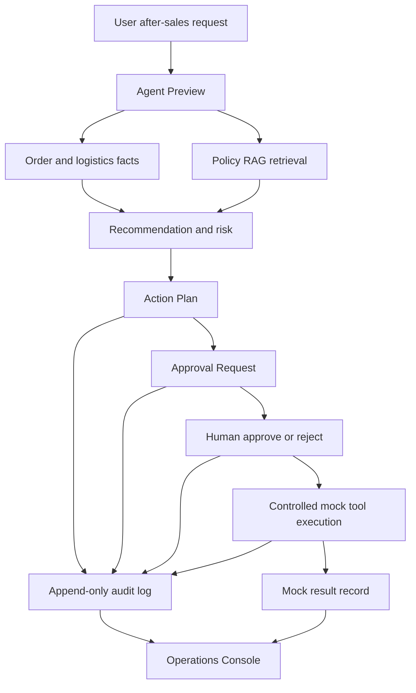

# CommerceFlow Agent Architecture Overview

## Purpose

CommerceFlow Agent is a controlled after-sales business Agent for portfolio demonstration. It shows how an Agent can retrieve facts, ground recommendations in policy evidence, require human approval for high-risk actions, execute only through validated mock tools, and preserve an audit trail.

## High-Level Flow

## Runtime Components

### FastAPI Backend

- Hosts read-only commerce APIs, policy search, Agent preview, action plan APIs, approval APIs, mock tool APIs, evaluation report APIs, and health checks.
- Keeps API routing thin. Business logic lives in services and repositories.

### Data Layer

- PostgreSQL stores mock commerce facts, policy documents/chunks, action plans, approvals, audit logs, and mock tool result records.
- pgvector stores deterministic policy embeddings.
- Redis is available as local infrastructure but is not used for uncontrolled business writes.

### Policy RAG

- Source policy documents live under `data/policies`.
- Ingestion turns structured JSON sections into policy chunks.
- Retrieval filters by metadata first: active status, effective window, intent, category, and aftersales type.
- Empty retrieval stays empty; the system does not fabricate policy support.

### Agent Workflow

- LangGraph preview workflow performs request parsing, order extraction, fact retrieval, policy retrieval, recommendation, risk classification, and response assembly.
- Deterministic unsafe detection has priority over LLM output.
- LLM output can assist intent extraction and customer reply wording only.

### Approval and Tool Execution

- Action Plan persistence is separate from Preview; preview remains read-only.
- Refund and high-value compensation require approval before execution.
- Tool execution is handled by internal services:
  - `refund_apply`
  - `coupon_issue`
  - `ticket_create`
- All write calls require `Idempotency-Key`.
- Original order, shipment, and policy rows are not modified by approval or mock tool execution.

### MCP Wrapper

- The stdio MCP server exposes the same mock tools as thin wrappers.
- MCP tools do not duplicate approval or idempotency logic.
- MCP tools do not open HTTP/SSE transports or public ports.

### Frontend Console

- Next.js Operations Console provides:
  - Overview;
  - Agent Workbench;
  - Case Detail;
  - Approval Center;
  - Tool Execution;
  - Audit Timeline;
  - Evaluation Dashboard.
- The frontend never sees provider API keys and never connects directly to PostgreSQL.

## Safety Invariants

1. The LLM never writes business data.
2. Refund execution requires a matching approved approval request.
3. High-value coupon compensation requires approval.
4. Idempotency is enforced by API/service logic and persistence.
5. Recommendations without policy evidence are not treated as executable.
6. Tool facts override model assertions.
7. Audit logs are append-only.
8. Prompt instructions cannot override security policy.
9. Evaluation and analytics are read-only.
10. Secrets are never committed.

## Evaluation

The MVP includes a deterministic evaluation runner:

- Dataset: `data/eval/mvp_eval_v1.jsonl`
- JSON report: `eval/reports/mvp_run_deterministic.json`
- Markdown report: `eval/reports/MVP_REPORT.md`

The saved deterministic baseline contains 100 cases and reports:

- Task Success Rate: 94.00%
- Unsafe Action Block Rate: 100.00%
- Approval Enforcement Rate: 100.00%
- Idempotency Protection Rate: 100.00%

The report intentionally keeps representative failures to show current system boundaries and future improvement targets.
