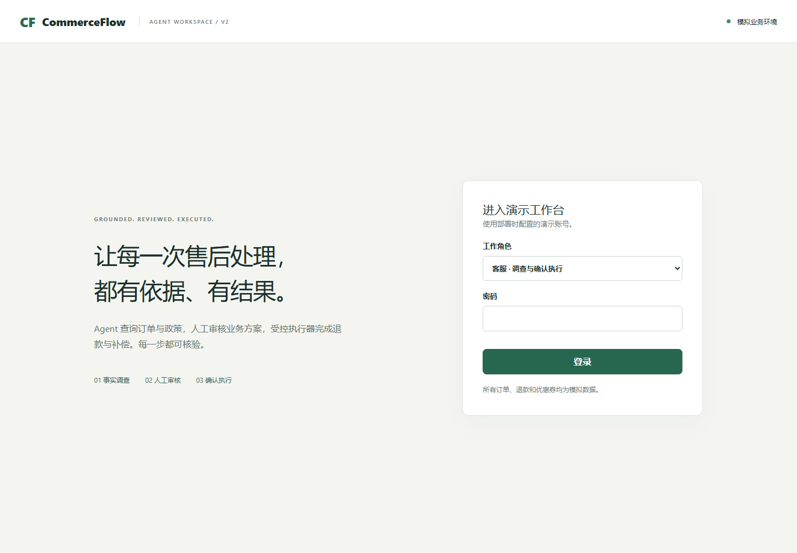
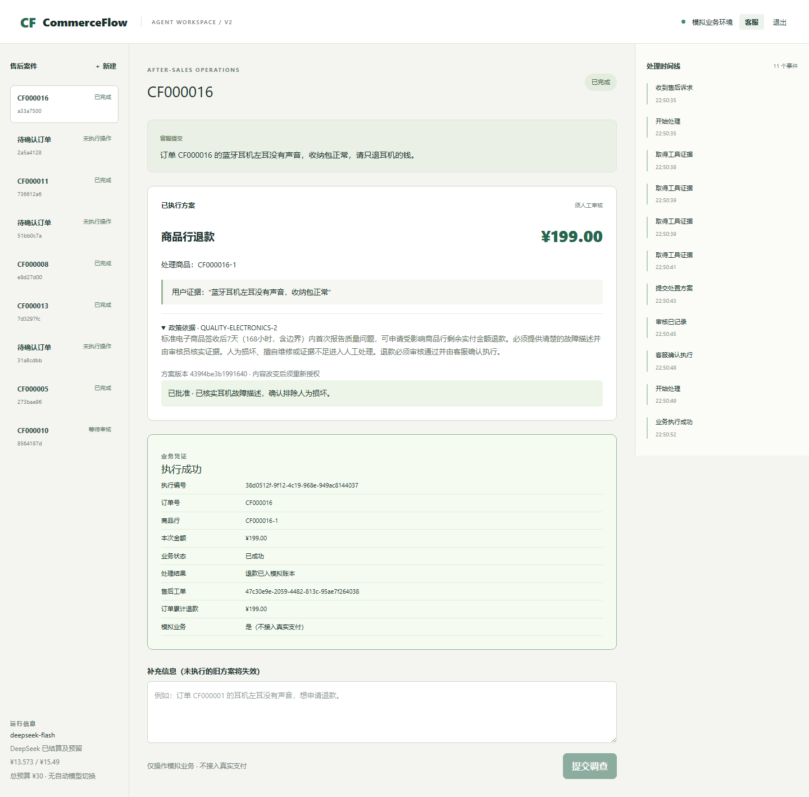
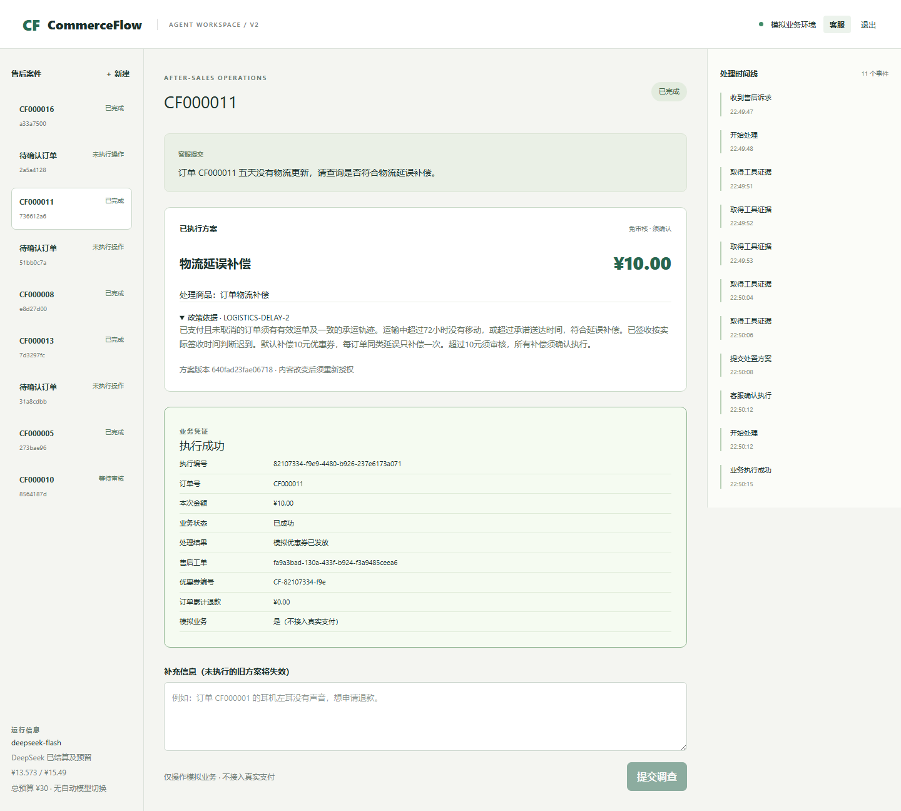
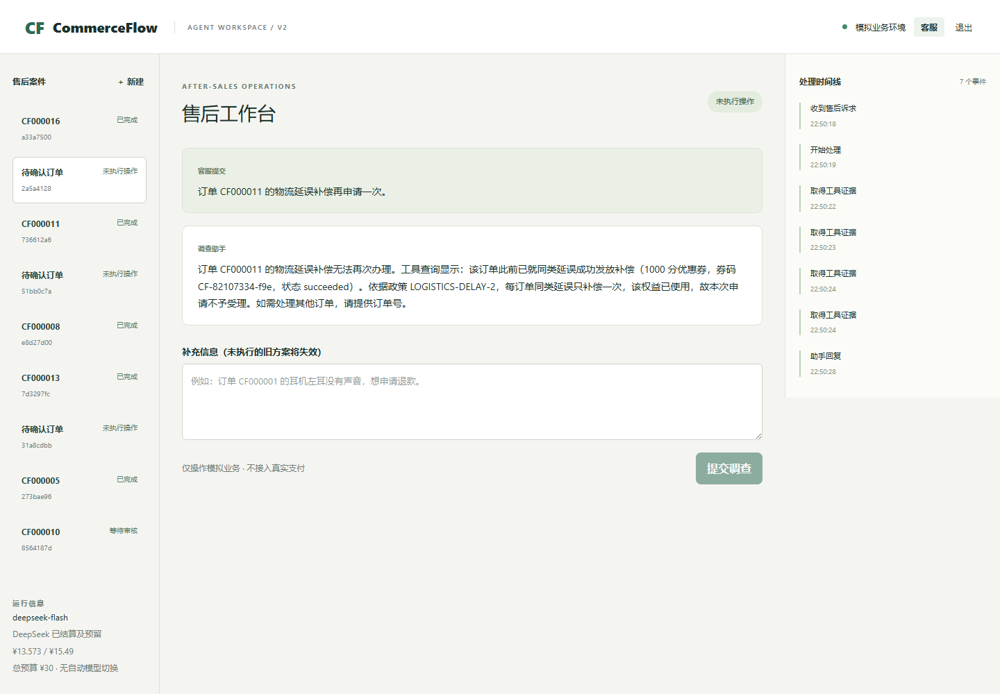

# v2 工程验收记录

日期：2026-09-18。所有业务均使用模拟订单、退款账本与优惠券，不连接真实支付。

## 本轮追加验证

- DeepSeek未改提示词的完整集三轮446/450（99.1%）；最终提示词完整集回归150/150。
- 最终开发集50/50、多轮验收12/12、基线4个失败各5次的专项回归20/20。
- 同版本固定工作流140/150。原始标签未更改；已看过测试失败后的结果称为回归成绩。
- 改进针对多余追问、把业务资格拒绝当作缺用户信息，以及擅自改换售后类型。
  模型权重未训练；政策、金额、审核和执行规则没有放宽。
- 本地完整后端41项通过（111.46秒）；随后增加预算上限接口测试，预算测试2项通过。
- 最终Agent的Playwright退款与补偿/重复申请两流程通过（约1.2分钟），截图已更新。
- 预算页面改为显示配置实际生效的上限；本轮下调至累计15.49元。
- 新增保守费用13.082836元，累计13.573162元；2825次项目调用全部结算，无未知用量。

[完整实验与原始事件](../eval/reports/v2/IMPROVEMENT.md) ·
[费用凭证](../eval/reports/v2/budget-improvement.json) ·
[求职展示入口](job-evidence-v2.md)。下文旧版交付记录保留其原有版本边界。

## 已验证

| 项目 | 实测证据 |
|---|---|
| 后端41项测试 | [GitHub CI 35328379499](https://github.com/JayYu686/commerceflow-agent/actions/runs/35328379499)，真实 PostgreSQL16/pgvector，含真实 MCP 服务与512维向量索引检查 |
| 安全边界 | 未审批退款、伪造审核员、未检查证据、旧方案确认、政策变化/失效、跨库连接、并发重复权益、请求键冲突、预算并发预留、10元阈值 |
| 真实进程恢复 | 业务服务提交后丢弃响应并终止 worker；替代 worker 按原执行ID恢复，业务结果及工单各一条；[本地恢复凭证](../eval/reports/v2/recovery-proof.json) |
| 多轮和断线续接 | 实际 Qwen：先追问订单号，补充后得到199元商品行方案，未审批无执行；SSE第二次连接从已收到ID之后返回。[凭证](../eval/reports/v2/multiturn-proof.json) |
| 真实网页退款 | 实际 Qwen 与 DeepSeek 分别走通两角色会话、审批、确认、199元问题商品退款，另一商品未退 |
| 网页补偿与防重 | 实际 DeepSeek：10元补偿须确认；同订单再次申请读到已领取权益，无新方案及执行入口 |
| 前端 | ESLint、TypeScript/Next.js生产构建、Playwright登录页，真实模型浏览器流程另在本地执行 |
| 完整容器交付 | Linux CI实际构建并启动 PostgreSQL、commerce、API、worker、web，验证同源代理、会话、业务种子和MCP查询；该步骤不调用收费模型 |

本地完整后端复测曾出现1项恢复测试启动等待超时（其余39项通过）；单独复测恢复通过，Linux CI完整40项通过。另一次首次报告时间测试曾把同一时刻的UTC与UTC+8字符串直接比较，已改为比较时刻。浏览器用例曾误匹配“新建”按钮、并误要求重复申请必须再次调用资格校验；修正断言后通过。没有把这些初次失败计为成功。

## 模型实测及版本边界

[完整报告](../eval/reports/v2/REPORT.md)保存三轮Qwen450次、固定基线150次和DeepSeek30次原始事件及失败。Qwen整体60.2%，未达80%目标；不能声称已优于固定流程或达到生产效果。关键参数正确率只统计订单号/商品行ID，政策库只有两项有效政策。

评测使用原始JSON记录的提交；之后修复了跨轮首次报告时间、签收轨迹冲突和容器MCP域名，并通过工程回归。没有重新跑完整模型集，不能把已有成绩当成后续版本的新测量。模型、推理配置和应用依赖见[运行记录](../eval/reports/v2/runtime.json)。

30条DeepSeek评测费用上界0.420772元。调试和演示调用同样受预算账本约束，包含它们的交付时总额见[预算快照](../eval/reports/v2/budget.json)。该数按最高适用单价保守计算，不是供应商发票或整个账号账单。

## 演示截图

截图来自真实运行的浏览器页面，不是设计稿。

## 运行限制

本机 Docker Desktop 未恢复，实际本地演示使用原生 Next.js/FastAPI，通过SSH访问独立 PostgreSQL；完整 Compose 在 Linux CI 验证。没有部署公网域名或在线托管。

共享3090上的Qwen评测实际用时约36分钟。评测结束后模型服务未及时停止，造成空闲占卡；交付已增加独立停止脚本。此次关闭后曾出现NVIDIA驱动相关D/Z状态，随后观察到服务器由外部重启，原GPU占用降至1MiB、利用率0%。本任务没有重置共享GPU、重启服务器、修改驱动或终止他人任务。恢复了独立数据库与隧道，未重新启动GPU推理；收尾演示显式选用DeepSeek，保持预算与模型标识，不作自动兜底。

该项目适合展示受控执行、真实工具调用、事务防重及恢复验证；上述模型短板和运行边界应当在面试中如实说明。
